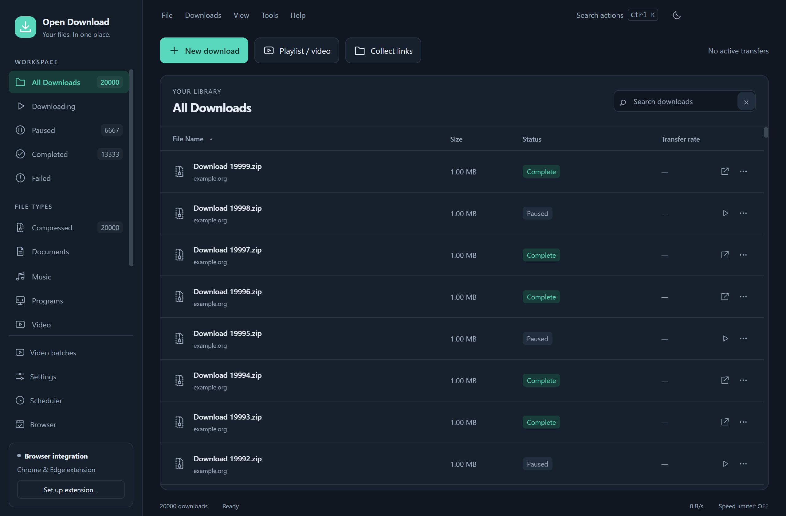

# Open Download Manager

[](https://github.com/mirzaahmergull/opendownloadmanager/actions/workflows/ci.yml) [](LICENSE)

A modern Windows and macOS download manager with light/dark themes, a focused desktop interface and a companion Chrome/Edge extension. This is an independent implementation, with original code and icons. It is not the proprietary Internet Download Manager application and is not affiliated with Tonec.



*Actual application screenshot with synthetic example downloads; no personal download history.*

## Get started

Download the [source and Chrome/Edge extension from Releases](https://github.com/mirzaahmergull/opendownloadmanager/releases/latest), or clone this repository and follow **Run or build from source** below. Windows is the validated platform; macOS support is experimental.

The first public release contains source and extension assets. Packaged desktop executables remain in a maintainer draft pending the third-party media-tool redistribution work described in [RELEASING.md](RELEASING.md). No published installer, browser-store listing or signed Mac build is currently available.

After starting the app, click **New download** to paste an address. Use **Video batches** for multiple playlists and **Browser** to pair the extension.

## Long-running video batches in 1.3.0

- **Video batches:** queue multiple playlists with separate folders, persistent import/progress and optional resume after reopening.
- **Browser session:** share YouTube cookies through an explicit extension button, with OS-encrypted storage and optional 30-minute refresh.
- **Pacing:** configurable gaps, rests, concurrency and smart rate-limit cooldown/session holds. Defaults favor one video at a time.
- **Developer tools:** S3/GCS destinations, resumable uploads, checksum verification and optional local cleanup after every remote copy is verified; storage/upload problems hold the batch.
- **Automatic yt-dlp updates:** daily official release checks, verified installation at idle and previous-engine restore.
- **Notifications:** errors and blockages only by default, with All and None modes.

See [BATCHES.md](BATCHES.md) for setup, authentication/permissions, exact controls, local working-space requirements and test limits. Cookies and pacing cannot guarantee YouTube will never restrict access. Production cloud accounts and native Mac execution remain untested.

## Faster transfers and fluid controls in 1.2.2

Balanced parallel ranges, connection reuse, buffered disk writes, no-copy publication on the same filesystem, asynchronous history saves and cheaper progress rendering reduce overhead. Segmented HLS/DASH video uses up to four fragment workers. See [PERFORMANCE.md](PERFORMANCE.md) for measured results, tests and source/server limits.

## Stability update 1.2.1

23 verified stability iterations cover recovery backups, transfer integrity, safe publication, process cancellation, failed conversions and dialog races. See [STABILITY_ITERATIONS.md](STABILITY_ITERATIONS.md) for individual fixes and checks.

## New in 1.2

- A cleaner sidebar and three primary actions: **New download**, **Playlist / video** and **Collect links**. Existing media, torrent, archive and queue features remain available through **Tools**, the command search and contextual menus.
- Light, dark and system appearance; original line icons; clearer progress; inline Pause/Resume/Open; restrained motion and keyboard navigation.
- **Ctrl/Cmd+K** searches actions. **Ctrl/Cmd+,** opens Settings. Drag a URL into the window to add it. Advanced options stay folded until needed.
- Downloads start in the background. Playlist selections and folders survive opening quality/subtitle preferences; closing an inspection cancels its process.
- Large histories render a bounded set of visible rows. Progress updates retain focus, send active-job deltas and checkpoint history periodically. Playlist/collector imports save once per batch. Large selection actions use one request and bounded asynchronous removal.
- Electron macOS app ZIPs for **Apple Silicon (arm64)** and **Intel (x64)**, with native menus, Command shortcuts and Mac media/archive tools. Requires macOS 13+. **Native Mac execution is untested; these are development builds without Developer ID signing/notarization.** See [MACOS.md](MACOS.md) for status and reproducible build/test steps.

## Collection, media and transfer features

Open **Tools**, **Collect links** or **Playlist / video**:

- **Link Collector:** paste mixed text, deduplicate links, check availability, filter the inbox and send selected package groups to a queue.
- **Media Library and Preferences:** review playlists/channels/search results; select entries; save quality up to 8K, MP4/MKV, audio format, subtitle languages, automatic captions, metadata and thumbnails. Browser default-quality handoffs inherit Smart Mode; explicit browser format choices take precedence.
- **Subscriptions:** add a channel or playlist and check for unseen videos while ODM runs. The first check imports the current inspected entries. Checks inspect at most 200 entries; remembered identifiers prevent repeats.
- **Torrents:** open a torrent file/address or v1 magnet, choose files, download verified pieces and resume after restart. Uploads are limited and stop when the selected files finish. Peer traffic is disabled when an HTTP proxy is configured.
- **Archives:** inspect and selectively extract completed ZIP/7z/RAR/TAR/GZ/XZ files. Enter passwords per operation; they are not saved. Optional automatic ZIP extraction is under Settings → Downloads. Multipart archives need all required volumes already present.
- **Remote ZIP Selection:** fetch only selected entries from servers with stable validators and byte ranges; CRC verifies extracted data. Metadata overhead can exceed a tiny ZIP's size. Encrypted remote ZIPs require downloading the full archive.
- **Organization Rules and Traffic Profiles:** route downloads by host/extension and switch Full, Balanced, Browsing or Custom speed limits, including a torrent upload limit.
- **Convert Media:** create MP4, MP3, M4A or FLAC beside a completed file. **Site Grabber** crawls a bounded same-origin website and sends reviewed results to the collector.
- **Add URL:** optional mirror addresses and an expected SHA-256 check; a mismatch blocks publication of the completed file.

See **FEATURE_RESEARCH.md** for sources, feature placement and remaining scope. Internet remote control, host account/CAPTCHA plugins, mobile apps, AI audio processing and playback before completion remain outside this release. Site extraction depends on yt-dlp support and the user's access to the content.

## Connect Chrome or Microsoft Edge

1. Keep the desktop app open and click **Browser**.
2. Open `chrome://extensions` or `edge://extensions` in your browser.
3. Turn on **Developer mode**, then click **Load unpacked**.
4. Select the extension folder shown in the desktop Integration dialog. The packaged app copies it to a persistent folder under its application data directory; it survives closing the portable executable.
5. Open the extension popup, paste the pairing token from the desktop dialog, and click **Connect**. The default port is **17843**.
6. Play a video and hover over it. Use **Download this video** for the default quality, or its arrow for quality choices and MP3 audio extraction.

The extension also adds link/video context menus and downloads selected links. Its popup displays detected media and can inspect video formats.

**Automatic browser capture** and **site cookie sharing** are off by default. Enable either in the extension popup if you want it. Cookie sharing requests the browser's optional cookies permission and sends cookies for the requested site's URL to the local desktop app. If the app is offline or pairing fails, automatic capture leaves the original browser download running.

The desktop app must be running for browser handoff. Use **Settings → General → Launch at startup** if you prefer to keep it available. Closing the main window normally minimizes to the tray; choose **File → Exit** or the tray's **Exit** command to stop it.

## Included features

| Area | Implemented behavior |
|---|---|
| Desktop | Modern light/dark interface, command search, sidebar, virtualized sortable download list, search, multiple selection, context menus, status bar, download properties |
| HTTP/HTTPS | Up to 32 connections, dynamic subdivision of unfinished ranges, connection reuse, redirects, retries, timeouts, unknown-length streams |
| Recovery | Pause/resume, persistent partial files, restart recovery, byte-range validation, validator checks, safe restart when a file changes |
| Files | Original server filenames, Windows filename sanitization, collision-safe saving, SHA-256 checksums, batch import/export |
| Categories | Editable extension associations and destination folders, automatic categories, custom categories |
| Queues | Multiple queues, file ordering, per-queue and global concurrency, manual start/stop, one-time and daily start/stop schedules |
| Videos | yt-dlp extraction, quality choices, separate audio/video merging through FFmpeg, HLS/DASH support through yt-dlp, MP3 audio extraction |
| Browser | Manifest V3 extension, video hover panel, YouTube handoff, media request detection, context menus, optional download takeover, selected-link downloads |
| Authentication | Basic authorization, optional browser cookies, scoped video cookie jars, host-platform encrypted credentials where Electron safeStorage is available |
| Proxies | HTTP, HTTPS and SOCKS agents for HTTP/HTTPS downloads; the video engine uses the configured proxy |
| FTP | Passive FTP/FTPS, login, single-connection downloading, modification-time validation and REST resume where advertised |
| Other | Bounded same-origin site grabber, clipboard URL suggestions, tray controls, configurable notifications, refresh expired download addresses |

## Everyday controls

- **Download Later** saves a stopped download. Select it and click **Resume**, or start its queue in **Scheduler**.
- **Stop** keeps partial data. **Delete** removes the list entry and partial data; completed files remain on disk.
- **Refresh download address** in the list's context menu can retain partial bytes when the new server address confirms the same size and validator.
- Right-click a category to create or edit categories.
- **Settings → Connection** controls connection count, concurrency and the speed limiter.
- **Settings → Proxy / SOCKS** accepts URLs such as `http://127.0.0.1:8080` or `socks5h://127.0.0.1:1080`.
- FTP addresses can use the Add URL dialog's authorization fields. Embedded FTP URL credentials are removed from the displayed URL and stored with encrypted credentials.

Shortcuts: **Ctrl+N** Add URL, **Ctrl+V** paste a link outside text fields, **Ctrl+A** select all filtered downloads, **Enter** download status, **Delete** remove, **F1** guide, **F5** refresh.

## Data locations

The app stores history, settings and partial files in Electron's platform application data folder for Open Download Manager. The default destination is your system Downloads folder's `Open Download Manager` subfolder, with category subfolders enabled. Both locations are separate from this source checkout.

Electron safeStorage encrypts stored request credentials, shared YouTube sessions, cloud keys, proxy credentials and the pairing token when host encryption is available (Windows DPAPI; macOS Keychain). Mac Keychain behavior still requires native testing. The renderer and browser status endpoint omit download cookies and request headers. Download list exports omit those credentials.

## Practical limits

- This reproduces the core workflow, not every proprietary IDM feature or its exact internals. It uses original branding and icons.
- Chrome and Edge are the intended browser targets; integration was exercised in Chromium. Firefox, Safari and legacy Internet Explorer integration are not included.
- Earlier live YouTube checks passed; the final 1.3.0 anonymous check encountered a bot challenge and verified queue blocking. Site changes, expired links, account restrictions and protected media can still prevent extraction. DRM decryption is not implemented.
- Schedules run while the app is running. They do not wake a powered-off computer. Modem dial-up, computer shutdown after a queue, web synchronization and IDM's proprietary registration/update system are not implemented.
- Site Grabber crawls up to 50 same-origin pages and depth 3. It does not execute page JavaScript.
- FTP uses one passive data connection and requires direct access; FTP through the configured proxy is not implemented. Explicit FTPS is available on port 21; other FTPS ports use implicit TLS.
- The speed limiter is shared across direct file transfers. Each video process gets a share at startup, so mixed video/file traffic is not governed by one perfectly synchronized limiter.
- Browser-generated `blob:` downloads remain in the browser. Very small downloads may finish there before a handoff can cancel them.
- The yt-dlp engine updates automatically from official releases when enabled. Electron, FFmpeg, the extension and application updates still require replacing/rebuilding the app; browser-store publishing is not configured.

## Run or build from source

Requirements: Windows x64, Node.js 24+, npm. `setup:windows` downloads pinned tools and verifies their checksums; the older `tools/setup.ps1` flow expects FFmpeg on PATH. Use MACOS.md for Mac setup and distribution limits.

```powershell
git clone https://github.com/mirzaahmergull/opendownloadmanager.git
cd opendownloadmanager
npm ci --ignore-scripts
node node_modules/electron/install.js
npm rebuild node-datachannel
npm run setup:windows
npm start
```

```powershell
npm test
npm run test:ui
npm run test:modern
npm run test:batches
npm run test:sessions
npm run test:updater:live
node test/advanced-ui.cjs
node test/advanced-media.cjs
npx playwright install chromium
npm run test:extension
npm run test:video
npm run test:youtube     # Live network test against a public YouTube video
npm run build           # Windows portable executable
```

`test:video` and `test:extension` generate their own small FFmpeg test fixture. For an additional live video-engine test, run `$env:ODM_TEST_YOUTUBE='1'; npm run test:video`. The tests use temporary application data and browser profiles, then remove them.

Source layout: `src/engine.cjs` transfer state and scheduling; `src/net.cjs` HTTP/proxy transport; `src/ftp.cjs` FTP transport; `src/main.cjs` desktop integration; `src/renderer.js`, `src/modern-renderer.js` and `src/modern.css` interface; `src/bridge.cjs` local browser bridge and grabber; `extension/` browser integration; `test/` verification.

Original application code is MIT licensed. Bundled dependencies retain their own licenses; see **THIRD_PARTY.md** and the included notices.

See **VERIFICATION.md** for the final test results, executable checksum and coverage limits. `node test/portable.cjs` tests the actual portable wrapper, including extraction, exact file bytes, local video/audio, bridge pairing and shutdown. Set `ODM_TEST_YOUTUBE=1` to also check live YouTube completion or a recognized challenge with the shared queue held for review. A blocked result does not demonstrate a successful live YouTube download.

## Contribute

See [CONTRIBUTING.md](CONTRIBUTING.md), [CHANGELOG.md](CHANGELOG.md) and [RELEASING.md](RELEASING.md). Use [Issues](https://github.com/mirzaahmergull/opendownloadmanager/issues) for bugs and feature requests and [Discussions](https://github.com/mirzaahmergull/opendownloadmanager/discussions) for questions. Private security reports belong in the repository Security tab. Original source is MIT; third-party executables retain their own licenses.
